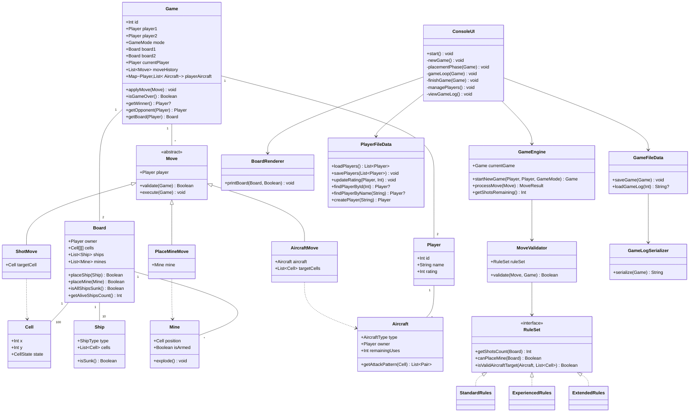

```mermaid
classDiagram
    class Game {
        +Int id
        +Player player1
        +Player player2
        +GameMode mode
        +Board board1
        +Board board2
        +Player currentPlayer
        +List~Move~ moveHistory
        +Map~Player,List~ Aircraft~~ playerAircraft
        +applyMove(Move) void
        +isGameOver() Boolean
        +getWinner() Player?
        +getOpponent(Player) Player
        +getBoard(Player) Board
    }

    class Player {
        +Int id
        +String name
        +Int rating
    }

    class Board {
        +Player owner
        +Cell[][] cells
        +List~Ship~ ships
        +List~Mine~ mines
        +placeShip(Ship) Boolean
        +placeMine(Mine) Boolean
        +isAllShipsSunk() Boolean
        +getAliveShipsCount() Int
    }

    class Cell {
        +Int x
        +Int y
        +CellState state
    }

    class Ship {
        +ShipType type
        +List~Cell~ cells
        +isSunk() Boolean
    }

    class Mine {
        +Cell position
        +Boolean isArmed
        +explode() void
    }

    class Aircraft {
        +AircraftType type
        +Player owner
        +Int remainingUses
        +getAttackPattern(Cell) List~Pair~
    }

    class Move {
        <<abstract>>
        +Player player
        +validate(Game) Boolean
        +execute(Game) void
    }

    class ShotMove {
        +Cell targetCell
    }

    class AircraftMove {
        +Aircraft aircraft
        +List~Cell~ targetCells
    }

    class PlaceMineMove {
        +Mine mine
    }

    class GameEngine {
        +Game currentGame
        +startNewGame(Player, Player, GameMode) Game
        +processMove(Move) MoveResult
        +getShotsRemaining() Int
    }

    class MoveValidator {
        +RuleSet ruleSet
        +validate(Move, Game) Boolean
    }

    class RuleSet {
        <<interface>>
        +getShotsCount(Board) Int
        +canPlaceMine(Board) Boolean
        +isValidAircraftTarget(Aircraft, List~Cell~) Boolean
    }

    class StandardRules
    class ExperiencedRules
    class ExtendedRules

    class ConsoleUI {
        +start() void
        -newGame() void
        -placementPhase(Game) void
        -gameLoop(Game) void
        -finishGame(Game) void
        -managePlayers() void
        -viewGameLog() void
    }

    class BoardRenderer {
        +printBoard(Board, Boolean) void
    }

    class PlayerFileData {
        +loadPlayers() List~Player~
        +savePlayers(List~Player~) void
        +updateRating(Player, Int) void
        +findPlayerById(Int) Player?
        +findPlayerByName(String) Player?
        +createPlayer(String) Player
    }

    class GameFileData {
        +saveGame(Game) void
        +loadGameLog(Int) String?
    }

    class GameLogSerializer {
        +serialize(Game) String
    }

    Game "1" -- "2" Player
    Game "1" -- "2" Board
    Game "1" -- "*" Move
    Board "1" -- "100" Cell
    Board "1" -- "10" Ship
    Board "1" -- "*" Mine
    Player "1" -- "*" Aircraft
    Move <|-- ShotMove
    Move <|-- AircraftMove
    Move <|-- PlaceMineMove
    GameEngine --> MoveValidator
    MoveValidator --> RuleSet
    RuleSet <|.. StandardRules
    RuleSet <|.. ExperiencedRules
    RuleSet <|.. ExtendedRules
    ShotMove ..> Cell
    AircraftMove ..> Aircraft
    PlaceMineMove ..> Mine
    ConsoleUI --> GameEngine
    ConsoleUI --> GameFileData
    ConsoleUI --> PlayerFileData
    ConsoleUI --> BoardRenderer
    GameFileData --> GameLogSerializer
```
