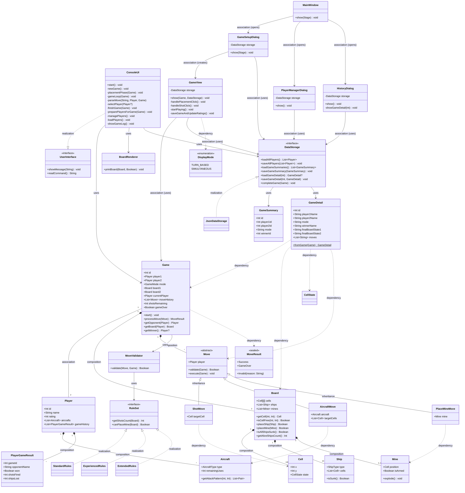

```mermaid
classDiagram
    class Game {
        +Int id
        +Player player1
        +Player player2
        +GameMode mode
        +Board board1
        +Board board2
        +Player currentPlayer
        +List~Move~ moveHistory
        +Int shotsRemaining
        +Boolean gameOver
        +start() void
        +processMove(Move) MoveResult
        +getOpponent(Player) Player
        +getBoard(Player) Board
        +getWinner() Player?
    }

    class Player {
        +Int id
        +String name
        +Int rating
        +List~Aircraft~ aircrafts
        +List~PlayerGameResult~ gameHistory
    }

    class PlayerGameResult {
        +Int gameId
        +String opponentName
        +Boolean won
        +Int shotsFired
        +Int shipsLost
    }

    class Board {
        +Cell[][] cells
        +List~Ship~ ships
        +List~Mine~ mines
        +getCell(Int, Int) Cell
        +isCellFree(Int, Int) Boolean
        +placeShip(Ship) Boolean
        +placeMine(Mine) Boolean
        +isAllShipsSunk() Boolean
        +getAliveShipsCount() Int
    }

    class Cell {
        +Int x
        +Int y
        +CellState state
    }

    class Ship {
        +ShipType type
        +List~Cell~ cells
        +isSunk() Boolean
    }

    class Mine {
        +Cell position
        +Boolean isArmed
        +explode() void
    }

    class Aircraft {
        +AircraftType type
        +Int remainingUses
        +getAttackPattern(Int, Int) List~Pair~
    }
    
    class Move {
        <<abstract>>
        +Player player
        +validate(Game) Boolean
        +execute(Game) void
    }

    class ShotMove {
        +Cell targetCell
    }

    class AircraftMove {
        +Aircraft aircraft
        +List~Cell~ targetCells
    }

    class PlaceMineMove {
        +Mine mine
    }

    class MoveResult {
        <<sealed>>
        +Success
        +Invalid(reason: String)
        +GameOver
    }

    class MoveValidator {
        +validate(Move, Game) Boolean
    }

    class RuleSet {
        <<interface>>
        +getShotsCount(Board) Int
        +canPlaceMine(Board) Boolean
    }

    class StandardRules {
    }

    class ExperiencedRules {
    }

    class ExtendedRules {
    }

    class DataStorage {
        <<interface>>
        +loadAllPlayers() List~Player~
        +saveAllPlayers(List~Player~) void
        +loadGameSummaries() List~GameSummary~
        +saveGameSummary(GameSummary) void
        +loadGameDetail(Int) GameDetail?
        +saveGameDetail(Int, GameDetail) void
        +completeGame(Game) void
    }

    class JsonDataStorage {
    }

    class GameSummary {
        +Int id
        +Int player1Id
        +Int player2Id
        +String mode
        +Int winnerId
    }

    class GameDetail {
        +Int id
        +String player1Name
        +String player2Name
        +String mode
        +String winnerName
        +String finalBoardState1
        +String finalBoardState2
        +List~String~ moves
        +fromGame(Game) GameDetail$
    }
    
    class UserInterface {
        <<interface>>
        +showMessage(String) void
        +readCommand() String
    }

    class ConsoleUI {
        +start() void
        -newGame() void
        -placementPhase(Game) void
        -gameLoop(Game) void
        -parseMove(String, Player, Game)
        -selectPlayer(Player?)
        -finishGame(Game) void
        -preparePlayersForGame(Game) void
        -managePlayers() void
        -loadPlayers() void
        -showGameLog() void
    }
    class BoardRenderer {
        +printBoard(Board, Boolean) void
    }

    class MainWindow {
        +show(Stage) void
    }
    class GameSetupDialog {
        -DataStorage storage
        +show(Stage) void
    }
    class GameView {
        -DataStorage storage
        +show(Game, DataStorage) void
        -handlePlacementClick() void
        -handleShotClick() void
        -startPlaying() void
        -saveGameAndUpdateRatings() void
    }
    class PlayerManagerDialog {
        -DataStorage storage
        +show() void
    }
    class HistoryDialog {
        -DataStorage storage
        +show() void
        -showGameDetail(Int) void
    }
    class DisplayMode {
        <<enumeration>>
        TURN_BASED
        SIMULTANEOUS
    }

    MainWindow --> GameSetupDialog : association (opens)
    MainWindow --> PlayerManagerDialog : association (opens)
    MainWindow --> HistoryDialog : association (opens)
    GameSetupDialog --> GameView : association (creates)
    GameSetupDialog --> DataStorage : association (uses)
    GameView --> Game : association (uses)
    GameView --> DataStorage : association (uses)
    GameView ..> DisplayMode : dependency
    PlayerManagerDialog --> DataStorage : association (uses)
    HistoryDialog --> DataStorage : association (uses)
    
    Game "1" -- "2" Player : association
    Game "1" *-- "2" Board : composition
    Game "1" *-- "*" Move : composition
    Board "1" *-- "100" Cell : composition
    Board "1" *-- "10" Ship : composition
    Board "1" *-- "0..3" Mine : composition
    Player "1" *-- "*" Aircraft : composition
    Player "1" *-- "*" PlayerGameResult : composition
    Move <|-- ShotMove : inheritance
    Move <|-- AircraftMove : inheritance
    Move <|-- PlaceMineMove : inheritance
    Game --> MoveValidator : uses
    MoveValidator --> RuleSet : uses
    RuleSet <|.. StandardRules : realization
    RuleSet <|.. ExperiencedRules : realization
    RuleSet <|.. ExtendedRules : realization
    ShotMove ..> Cell : dependency
    AircraftMove ..> Aircraft : dependency
    PlaceMineMove ..> Mine : dependency
    Game ..> MoveResult : dependency
    ConsoleUI ..|> UserInterface : realization
    ConsoleUI --> Game : uses
    ConsoleUI --> BoardRenderer : uses
    ConsoleUI --> DataStorage : uses
    DataStorage <|.. JsonDataStorage : realization
    GameDetail ..> Game : dependency
    GameDetail ..> Board : dependency
    GameDetail ..> CellState : dependency
    GameDetail ..> Move : dependency
    DataStorage --> GameSummary : uses
    DataStorage --> GameDetail : uses
```